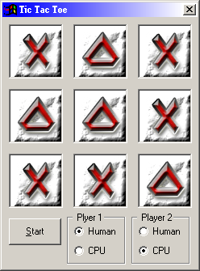



## Tic Tac Toe with AI

### Description

This is yet another game of tic tac toe. It has four game modes. player vs player, player vs cpu (player goes first), cpu vs player (cpu goes first) and cpu vs cpu. I tryed to make the computer as smart as possible so you shouldnt be able to win. If you find a way to win please let me know. All the code is fully commented so the logic should be easy to understand. Also, the X and 0 pictures are loaded from 2 different pictureboxes, you can easily change the pictures and make the whole thing skinable. Please leave feedback.
 
### More Info
 

             |
---                |---
**Submitted On**   |2001-04-04 16:13:52
**By**             |[Izek\_S](https://github.com/Planet-Source-Code/PSCIndex/blob/master/ByAuthor/izek-s.md)
**Level**          |Intermediate
**User Rating**    |4.1 (33 globes from 8 users)
**Compatibility**  |VB 4\.0 \(32\-bit\), VB 5\.0, VB 6\.0
**Category**       |[Games](https://github.com/Planet-Source-Code/PSCIndex/blob/master/ByCategory/games__1-38.md)
**World**          |[Visual Basic](https://github.com/Planet-Source-Code/PSCIndex/blob/master/ByWorld/visual-basic.md)
**Archive File**   |[Tic Tac To17914442001\.zip](https://github.com/Planet-Source-Code/izek-s-tic-tac-toe-with-ai__1-22137/archive/master.zip)

